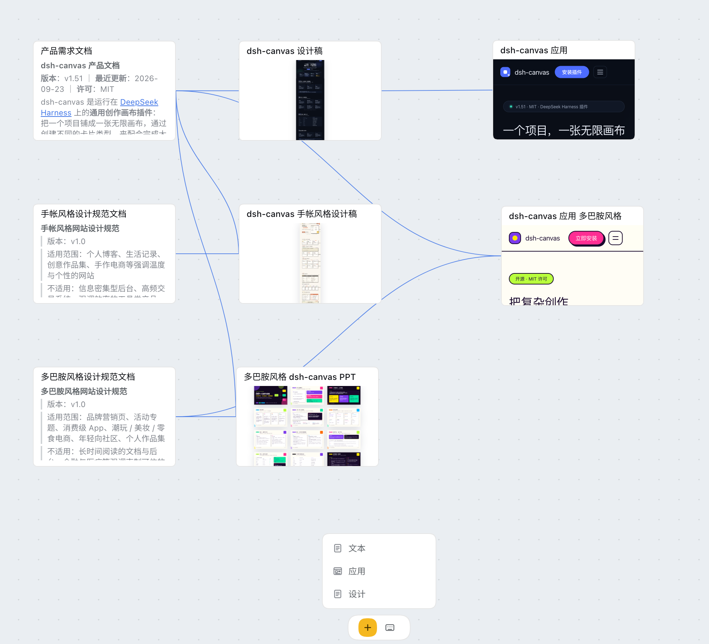
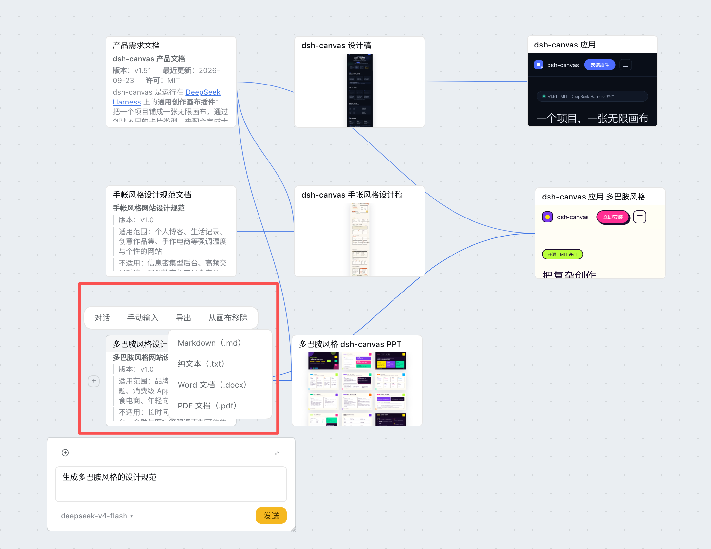
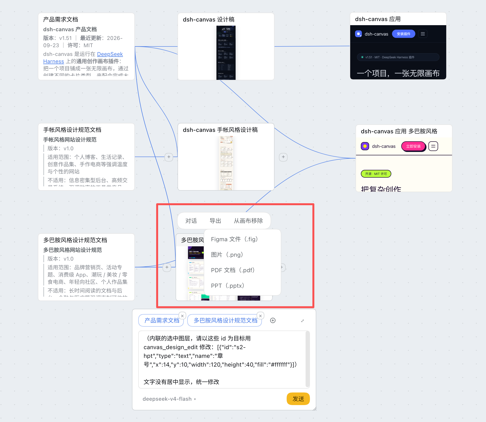

# dsh-canvas

跑在 [DeepSeek Harness](https://github.com/deepseek-ai/deepseek-harness) 上的**无限画布插件**：把一个项目铺成一张无限画布，通过创建不同的卡片类型，卡片间通过连线引用，共同配合完成大型复杂的任务。

<video src="docs/Dsh_Canvas_Tutorial.mp4" controls muted width="100%"></video>

---

## 主要功能

- 通过文本卡片生成需求文档，通过设计卡片生成网站设计或者 PPT，通过应用卡片生成 web 应用。

- 所有卡片类型都支持导出。
  - 文本卡片：支持导出 Markdown、纯文本本文档、Word 文档、PDF 文档。

  

  - 设计卡片：支持导出 Figma 文件、图片、PDF、PPT。

  

  - 应用卡片：支持导出 web 应用压缩包，双击 index.html 运行即可。

## 安装插件

在 DeepSeek Harness 客户端中安装插件。

## 路线图

### 已实现

| 能力 | 现状 |
|------|------|
| **文本** | Agent 生成 Markdown 文档，支持导出 Markdown 文档、纯文本本文档、Word 文档、PDF 文档 |
| **设计** | Agent 生成设计稿， Agent 精确二次修改指定图层。可导出 Figma 文件、图片、PDF、PPT |
| **应用** | Agent 生成 web 应用代码，支持直接在 DeepSeek Harness 客户端运行。支持指定元素， Agent 精确二次修改指定元素的代码。 |

### 后续

| 能力 | 计划 |
|------|------|
| **图片** | 图片产物接入生成与编辑闭环，与文本、设计共用同一套卡片与引用关系 |
| **视频** | 视频产物的生成与预览 |
| **音频** | 音频产物的生成与预览 |

---

## 许可

[MIT](LICENSE) © 2026 ljcoder2015
